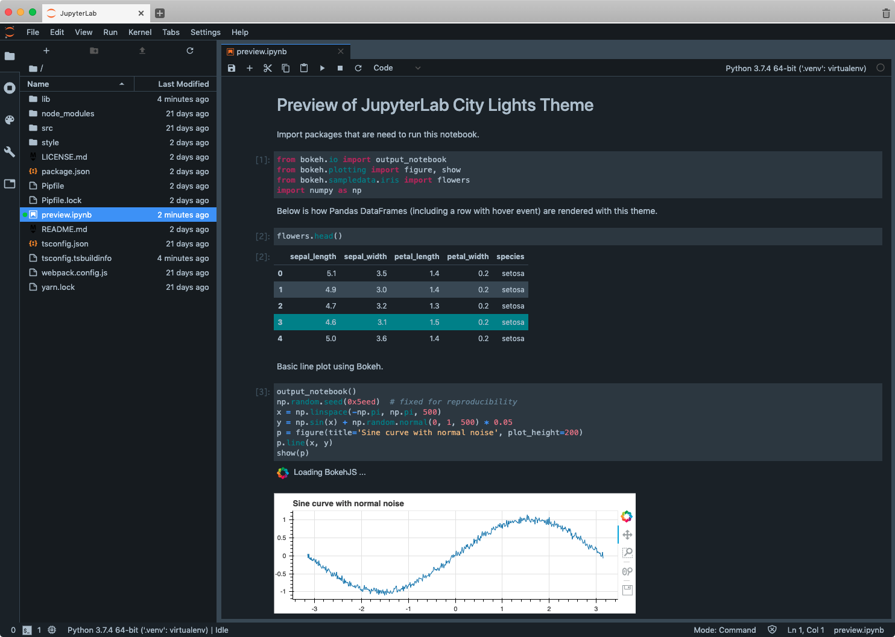

# JupyterLab City Lights Theme
[](https://www.npmjs.com/package/@yudai-nkt/jupyterlab_city-lights-theme)
[](https://github.com/yudai-nkt/jupyterlab_city-lights-theme/actions?query=workflow%3Abuild+branch%3Amaster)

A port of the [City Lights](http://citylights.xyz/) theme for JupyterLab



## Installation

Run the following command in your terminal.

```bash
jupyter labextension install @yudai-nkt/jupyterlab_city-lights-theme
```

## Development

For a development install (requires npm version 4 or later), do the following in the repository directory:

```bash
npm ci
jupyter labextension link .
```

To rebuild the package and the JupyterLab app:

```bash
npm run build
jupyter lab build
```
## License

This repository is licensed under the MIT License. See [LICENSE.md](./LICENSE.md) for details.

## Acknowledgement

This JupyterLab theme was never made possible without the City Lights color palette originally designed by [Yummygum](https://yummygum.com/).
I appreciate their great work.
